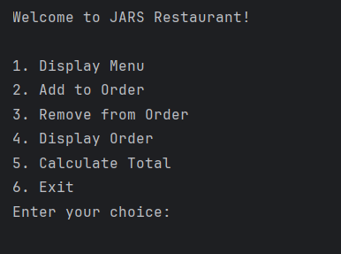
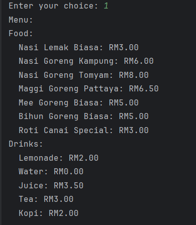
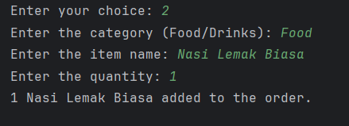
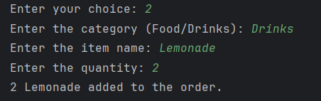
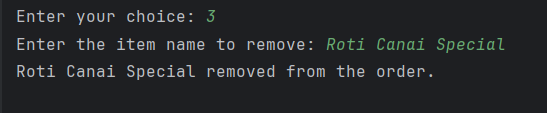
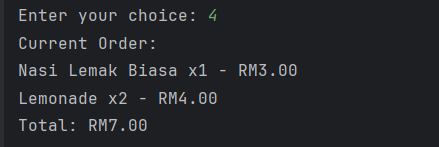
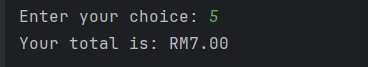
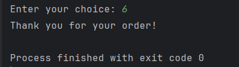

# Food Ordering System

A console-based **Food Ordering System** developed in **Python** as part of a group project for the **Computer Engineering Practice 2** course. The application allows users to browse the menu, add or remove food items, view their current order, and calculate the total bill through a simple and user-friendly interface. The project demonstrates the application of object-oriented programming, modular programming, and user input handling in Python.

## Features

- Browse food and drink menu
- Add food and drinks to an order
- Remove items from an order
- Display current order
- Calculate total bill
- Console-based user interface
- Menu management using Object-Oriented Programming (OOP)

## Technologies Used

- Python
- Object-Oriented Programming (OOP)
- Modular Programming

## Project Structure

```text
Food-Ordering-System-Python/
│
├── code/
│   └── main.py
│
├── images/
│   ├── 01_Main_Menu.png
│   ├── 02_Display_Menu.png
│   ├── 03_Add_to_Order_Food.png
│   ├── 04_Add_to_Order_Drinks.png
│   ├── 05_Remove_from_Order.png
│   ├── 06_Display_Order.png
│   ├── 07_Calculate_Total.png
│   └── 08_Exit.png
│
├── operational-flowchart/
│   └── Flowchart.pdf
│
└── README.md
```

## Screenshots

### 1. Main Menu


### 2. Display Menu


### 3. Add Food to Order


### 4. Add Drinks to Order


### 5. Remove Item from Order


### 6. Display Current Order


### 7. Calculate Total Bill


### 8. Exit Application


## Learning Outcomes

This project strengthened my understanding of Python programming, object-oriented programming, modular program design, and user input handling while developing a practical console-based food ordering application. It also enhanced my problem-solving skills and experience in designing interactive menu-driven systems.

## Author

**Reeshaleni D/O Balakrishenan**

Computer Engineering Practice 2 Course Assignment

Bachelor of Computer Engineering with Honours (BERR)

Universiti Teknikal Malaysia Melaka (UTeM)
